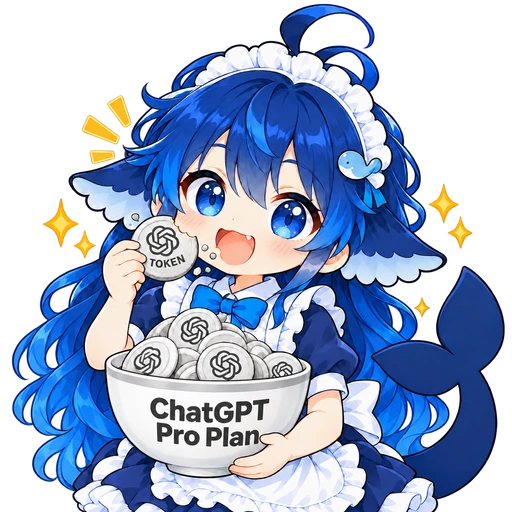

# DeepSeek Harness · Sign in with ChatGPT

**简体中文** | [English](README.en.md)



在 [DeepSeek Harness](https://github.com/deepseek-ai/deepseek-harness) 中使用你自己的 ChatGPT 套餐。安装插件，通过 **Continue with ChatGPT** 独立登录、授权，再从 DSH 模型菜单选择账号可用的模型。

这是一个非官方、以 MIT 许可提供源码的本地插件。每位使用者都需要自行授权，安装包不包含账号、凭证或共享额度。插件遵循 [OpenAI 的开源应用接入流程](https://developers.openai.com/siwc/token-sharing-open-source/sign-in)，不需要填写 API Key，也不读取 Codex 或 Pi 的登录文件。

## 安装前准备

| 项目 | 版本 / 要求 |
| --- | --- |
| 插件 | **0.1.0** |
| DeepSeek Harness | **0.2.0-rc.2** |
| DSH 使用的 pi-ai | **0.87.1**（由宿主提供） |
| 已验证的桌面环境 | macOS；其他平台尚未验证 |
| ChatGPT 账号 | 具备 OpenAI 当前允许的套餐接入资格，并同意应用使用套餐 |

模型与限制以 OpenAI 为该账号返回的结果为准。图标中的 “ChatGPT Pro Plan” 是插画文字，不表示仅支持 Pro，也不表示包含无限额度。DSH 升级后需要重新核对兼容性。

关于宿主提供的 pi-ai、本插件复用的实现及版本兼容性，见后文 [pi-ai 依赖关系](#pi-ai-依赖关系)。

## 安装

从 [v0.1.0 Releases](https://github.com/WillQvQ/dsh-chatgpt-plan/releases/tag/v0.1.0) 下载 **`dsh-chatgpt-plan-0.1.0.tgz`**。使用这个插件包；GitHub 自动生成的 Source code 压缩包用于查看源码。

先完全退出 DSH。在 macOS 终端执行以下命令（假设文件保存在下载目录，App 安装在 `/Applications`）：

```sh
"/Applications/DeepSeek Harness.app/Contents/Resources/runtime/cli/bin/dsh" \
  plugin --profile desktop add "$HOME/Downloads/dsh-chatgpt-plan-0.1.0.tgz"
```

安装过程会解析 `undici` 等运行时依赖，需要能够访问包仓库。不要仅复制单个源码文件。安装完成后重新打开 DSH，确认插件列表中的 `dsh-chatgpt-plan` 已启用。

如果 App 安装在其他位置，请修改命令中的路径。使用其他 DSH 配置时，将 `desktop` 改为实际配置名；不同配置需要分别安装和授权。

## 第一次登录与使用

1. 打开 DSH **设置 → ChatGPT 套餐 → Continue with ChatGPT**。
2. 在本地账号管理页点击 **Continue with ChatGPT**，进入 OpenAI 的浏览器授权页面。
3. 核对 ChatGPT 账号及应用名称 **DeepSeek Harness**，按需允许使用套餐。只完成身份登录、未允许套餐使用时，插件不能发起推理。
4. 授权完成后回到 DSH，在会话模型菜单选择 **ChatGPT 套餐（独立授权）** 下的模型。
5. 发送一条消息。DSH 继续负责会话历史、本地工具、文件权限和流式显示。

始终从 DSH 设置中的链接进入账号管理页。它仅监听本机，优先使用端口 `18762`，冲突时自动选择空闲端口；固定地址不适用于所有 DSH 实例。

## 添加与切换账号

1. 在账号页点击 **添加账号 · Continue with ChatGPT**，在 OpenAI 页面确认或切换到要添加的账号。
2. 每个账号分别授权，用 **修改备注** 标记“个人 Pro”“工作账号”等名称。
3. 点击 **切换到此账号**，回到 DSH 重新选择该账号可用的模型。

切换会中止旧账号正在进行的请求，并刷新模型列表。每个注册独立保存凭证和模型，即使邮箱相同也不会合并；一次只有一个当前账号。插件不会自动轮换账号、合并额度，或在失败、退出后改用其他账号。

切换账号不会清空 DSH 已有会话。如需隔离聊天内容，请新建会话。

## 网络设置

在账号管理页的 **网络连接** 中选择：

| 模式 | 行为 |
| --- | --- |
| 使用环境代理设置 | 读取 `HTTP_PROXY`、`HTTPS_PROXY`、`ALL_PROXY`、`NO_PROXY`，支持小写变量；不会自动读取 macOS 系统代理 |
| 直接连接 | 不使用代理 |
| 指定 HTTP(S) 代理 | 如 `http://127.0.0.1:7890`；不支持 SOCKS、账号密码、路径或查询参数 |

保存设置会中止当前插件请求。设置仅影响本插件；浏览器授权页面使用浏览器自身的网络配置。从 Finder 启动的 App 不一定继承终端中的代理环境变量，连接有问题时可直接指定 HTTP(S) 代理。

## 用量、续期与退出

点击 **管理 ChatGPT 用量与额度**，或打开 [ChatGPT 设置 → 用量](https://chatgpt.com/settings/usage)，查看和管理应用用量。插件没有“剩余总额度”仪表盘；额度与访问限制由 OpenAI 管理。

插件按需续期，遵守服务返回的最早续期时间。暂时的网络错误不会删除仍有效的登录，已到期的凭证不会继续用于请求。推理收到 HTTP 401 时最多续期并重试一次；已经开始返回的响应流不会重发。

在账号页退出时，插件尝试撤销该注册的续期会话，然后清除本地 token。若网络导致远程撤销无法确认，会明确提示。彻底断开应用：**ChatGPT 设置 → 安全与登录 → 使用 ChatGPT 登录 → DeepSeek Harness → 断开**。详情见 [OpenAI 账号与会话文档](https://developers.openai.com/siwc/token-sharing-open-source/profiles-and-sessions)。

## 常见问题

| 现象 | 处理方法 |
| --- | --- |
| 设置中没有插件入口 | 确认安装到正在使用的 DSH 配置、插件已启用，再完全退出并重新打开 DSH |
| 登录成功但没有模型 | 确认已允许套餐使用，刷新模型列表，并检查账号资格及网络 |
| 浏览器能授权，插件连接失败 | 分别检查浏览器网络和插件网络设置 |
| 切换账号后模型不可用 | 重新选择新账号实际提供的模型 |
| 提示授权失效 | 在账号页重新登录，不要复制其他应用的 token 文件 |
| 提示凭据权限异常 | 检查文件属于当前用户、不是软链接，且只允许所有者读写；不要把账号文件发到 Issue |

## 数据与授权方式

账号文件位于当前 DSH 配置目录下的 `data/dsh-chatgpt-plan/accounts.json`，同目录的 `network.json` 保存网络选项。macOS 的 desktop 配置通常对应 `~/.dsh/profiles/desktop/data/dsh-chatgpt-plan/`。目录权限为 `0700`，文件为 `0600`。

凭证保存在本地文件中，**不是加密保险库**；同一系统用户或具有相应系统权限的程序仍可能读取它。不要共享账号文件、完整授权回调 URL、token 或含有这些内容的日志。仓库与插件包不包含运行时账号数据。

实现使用动态注册、Authorization Code + PKCE、独立的 state / nonce，并验证 ID token 的签名、issuer、audience、有效期和身份。凭证原子写入，文件锁串行续期。本地管理页校验 Host、Origin、CSRF，前端不接收 OAuth token。

模型列表来自 `https://api.openai.com/v1/models`，推理调用 `https://api.openai.com/v1/responses`，固定 `store:false`、`stream:true`。插件适配本地工具调用，不调用 ChatGPT `backend-api`，也不会回退到 API Key 计费。其他联网搜索或外部服务保持 DSH 原配置。接口约束见 [模型与推理](https://developers.openai.com/siwc/token-sharing-open-source/models-and-inference) 和 [预览限制](https://developers.openai.com/siwc/token-sharing-open-source/preview-limitations)。

## 升级与移除

升级时先退出 DSH，再用安装命令添加新的 `.tgz`。正常升级保留同一 DSH 配置中的账号文件，重新打开 DSH 后检查连接。

移除前，先在账号页退出登录，将 DSH 默认模型切换到其他提供方，然后退出 DSH，执行：

```sh
"/Applications/DeepSeek Harness.app/Contents/Resources/runtime/cli/bin/dsh" \
  plugin --profile desktop remove dsh-chatgpt-plan
```

卸载插件不等于在 OpenAI 端断开应用。如需完全撤销访问，请同时按上面的退出说明操作。

## pi-ai 依赖关系

**使用本插件不需要另外安装 Pi App。** 本插件复用 DSH 宿主提供的 `@deepseek-ai/dsh-llm-pi-ai` 和 `@earendil-works/pi-ai`；当前验证组合是 DSH **0.2.0-rc.2** 与 pi-ai **0.87.1**，对应版本也声明在本项目的 [peerDependencies](package.json) 中。

### DSH 主要在哪里依赖 pi-ai

在这里核对的 DSH 0.2.0-rc.2 源码中，对 pi-ai 的直接使用主要集中在 [`@deepseek-ai/dsh-llm-pi-ai`](https://github.com/deepseek-ai/deepseek-harness/tree/639ed015397290b3745d163aafe02ffee4aa3f84/packages/llm/llm-pi-ai/src) 这一模型适配层：

- **供应商与模型目录、认证接口**：接入 pi-ai 的供应商定义、模型能力和认证流程，并与 DSH 的配置及凭证管理衔接。
- **请求协议与流式处理**：使用 pi-ai 的 OpenAI Responses、Chat Completions、Anthropic Messages 等协议实现，处理返回的响应事件。
- **DSH 与 pi-ai 之间的转换**：由 DSH 的适配代码转换消息上下文、工具定义、流式事件、用量和历史回放信息，供 DSH 的模型接口使用。

Agent 循环、工具执行、文件权限、会话存储、插件系统和界面仍由 DSH 提供。DSH 的[原生 DeepSeek 适配器](https://github.com/deepseek-ai/deepseek-harness/tree/639ed015397290b3745d163aafe02ffee4aa3f84/packages/llm/llm-deepseek)也有独立实现；上述依赖集中在模型接入层。

### 本插件具体复用了什么

本插件只注册 ChatGPT 套餐这一提供方。DSH 对 pi-ai 的整体使用范围，比本插件直接使用的部分更广。

| 实现来源 | 在本插件中的职责 |
| --- | --- |
| DSH 自带的 `PiAiAdapter` | 将插件提供的模型与请求结果接入 DSH 的模型接口，复用消息、工具和流式事件转换 |
| DSH 自带的 `pi-ai/api/openai-responses` | 构造 Responses 请求并解析流式响应，调用入口为 `stream` / `streamSimple` |
| 本插件 | ChatGPT 独立授权、账号管理、凭证续期、账号可用模型发现，以及套餐请求参数和本地工具调用的适配 |

具体导入与注册见 [index.mjs](index.mjs)，请求适配见 [adapter.mjs](adapter.mjs)。插件的 ChatGPT 登录流程由 [oauth.mjs](oauth.mjs) 实现，不读取 Pi 或 Codex 的登录文件。

### 如何理解与新版 pi-ai 的关系

作为版本对照，[pi-ai 1.0.2 已包含 Sign in with ChatGPT 的实现](https://github.com/earendil-works/pi/blob/v1.0.2/packages/ai/src/auth/oauth/openai-chatgpt.ts)。本项目针对这里验证的 DSH / pi-ai 组合，把 ChatGPT 套餐接入做成可单独安装、带账号管理界面的 DSH 插件。

上游已有这一能力，不代表旧版 DSH 已经包含它，也不代表将宿主中的 pi-ai 直接替换成 1.x 就能保持兼容。单独升级系统或其他项目里的 pi-ai，也不会升级 DSH 安装包内的依赖。升级 DSH 或调整依赖后，需要重新验证插件加载、授权、模型发现、流式回复和工具调用。

关于长期维护接口的讨论，见 [DSH 社区帖子](https://github.com/deepseek-ai/deepseek-harness/discussions/8851)。

## 从源码打包与开发

使用 Node.js 22 或更高版本（本次验证使用 Node.js 24）。没有编译步骤：

```sh
git clone https://github.com/WillQvQ/dsh-chatgpt-plan.git
cd dsh-chatgpt-plan
npm test
npm pack --ignore-scripts
```

`npm test` 使用 Node 内置测试工具和模拟响应，不需要真实账号、互联网或已安装的 DSH 宿主依赖。`npm pack` 生成 `dsh-chatgpt-plan-0.1.0.tgz`，按前述命令安装；实际运行的依赖由 DSH 安装过程解析。

测试覆盖账号隔离、PKCE / 身份校验、切换取消、续期退避、401 重试、撤销、存储权限、配置隔离、端口冲突、网络设置和管理页访问控制。在安装了兼容版本 DSH 的 macOS 上，还可运行原生适配器模拟测试：

```sh
ELECTRON_RUN_AS_NODE=1 "/Applications/DeepSeek Harness.app/Contents/MacOS/DeepSeek Harness" \
  scripts/wire-test.mjs
```

这个测试也使用模拟网络。模拟通过不代表任意真实账号都具备接入资格；真实验证需要账号所有者完成授权。

## 许可与图标

代码采用 [MIT License](LICENSE)。图标为非官方二创，包含 AI 生成的 DeepSeek 少女与 ChatGPT Token 插画，不表示由 DeepSeek 或 OpenAI 发布、认证或背书。代码许可证不授予第三方品牌或原角色设计的权利。
